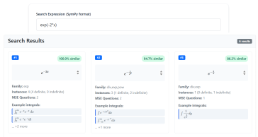

  

  <strong>Semantic search for mathematical integrals using E-Gen embeddings and contrastive learning</strong>

  
  

A focused implementation of E-Gen embeddings (Zheng et al., 2025) for mathematical integral similarity search. The system uses transformer-based contrastive learning to find semantically similar integrals from a database of 12,337 unique integrands sourced from Math StackExchange.

  

 Live demo: <a href="https://integralindx.fly.dev">integralindx.fly.dev</a> · Further reading: <a href="https://integralindx.fly.dev/theory">theory page</a>

---

## Motivation

In my mathematics research, I constantly search for integrals online, and it's often frustrating. Mathematical expressions have many equivalent representations (`e^x` vs. `exp(x)`, order of operations, arbitrary variable names), and traditional textual search can't understand this semantic equivalence, you only find syntactic matches.

I wanted to build a search engine that actually understands mathematical structure, not just character patterns. The challenge is getting good embeddings that capture mathematical meaning. Training such embeddings requires massive datasets of equivalent expressions, which are hard to generate. The recent [E-Gen](https://arxiv.org/abs/2501.14951) paper (Zheng et al., 2025) solved this beautifully using **e-graphs** (equality graphs), a data structure that applies mathematical rewrite rules to systematically generate all equivalent forms of an expression. Starting with just a small seed set, E-Gen can produce hundreds of equivalent variants per expression, creating rich training data for contrastive learning.

This project is my implementation of that idea. I built a curated database of 12,337 unique integrands from Math StackExchange, implemented the full E-Gen pipeline with custom rewrite rules, and trained a transformer to produce semantic embeddings. This demo serves as a playground to test how well E-Gen embeddings capture mathematical similarity in real-world integral search. I hope to eventually extend this approach to other mathematical objects (sums, products, special function identities) and continue scaling the database as I refine the data processing pipeline.

---

## Key Features

- **Semantic Search**: Finds mathematically similar integrals based on semantics, not just syntactic pattern matching
- **Large Curated Dataset**: 12,337 unique integrand groups from 23,638 Math StackExchange integral instances
- **Custom E-Gen Implementation**: Forked the original Rust e-gen implementation with custom mathematical rewrite rules
- **End-to-End Pipeline**: Complete data processing from raw LaTeX scraping through normalization, SymPy parsing, validation, variable canonicalization, and grouping
- **Contrastive Transformer**: 6-layer encoder architecture (19M parameters) trained on 15.7M triples
- **Fast Similarity Search**: FAISS-based vector search
- **Web App**: Clean UI with MathJax rendering and direct links to Math StackExchange sources

---

## Technical Overview

### Architecture

*Transformer encoder with mean pooling. Input tokens pass through 6 transformer layers with multi-head self-attention (8 heads) and feed-forward networks (2048D), producing 512-dimensional embeddings.*

| Component | Specification |
|-----------|-----------|
| **Model Type** | Encoder-only transformer (contrastive learning) |
| **Layers** | 6 |
| **Hidden Dimension** | 512 |
| **Attention Heads** | 8 |
| **FFN Dimension** | 2048 |
| **Dropout** | 0.1 |
| **Embedding Dimension** | 512 |
| **Vocabulary Size** | 62 tokens |
| **Total Parameters** | 18,946,048 (~19M) |
| **Loss Function** | InfoNCE (temperature=0.1) |

**Workflow**: SymPy > Variable Normalization > Prefix Notation > Tokenization > Transformer Encoder > Mean Pooling > 512D Embedding > FAISS Search

### Data Pipeline

From **206,328 raw Math StackExchange expressions** to **23,638 validated integrals** in **12,337 unique groups**:

1. **MSE Scraping**: Queried Math StackExchange API across 20 integral-related tags (closed-form, integration, definite-integrals, special-functions, polylogarithm, etc.), extracting LaTeX from both questions and answers

2. **LaTeX Normalization**: Custom parsing to clean raw LaTeX, extract relation chains (A = B = C), separate parametric conditions, and handle complex equation environments

3. **Integral Extraction & Validation**: Parsing for definite/indefinite integrals with SymPy validation.

4. **Variable Normalization**: Canonicalization for ML training: standardize integration variables to `x`, normalize parameters alphabetically to `a, b, c` (max 3 parameters), group by unique integrand hash

5. **Symbol Validation**: Whitelist-based filtering for allowed functions (trig, hyperbolic, exp, log, polylog, zeta) and parameters; rejection of spurious symbols, subscripted variables, and unknown functions

### Training Data Generation

**Stage 1 - Seed Freezing & E-Gen Generation:**
- 1,793 frozen seed expressions (337 hand-crafted synthetic + 1,456 from database)
- Applied E-Gen e-graph rewriting
- 1,243 seeds successfully generated equivalents (69.3% success rate)
- Average of 154 equivalents per seed (median: 74)
- **Total**: 191,394 equivalent expressions across all clusters

**Stage 2 - TSV Dataset Construction:**
- Seed-level splitting (80/10/10 train/val/test) to prevent data leakage
- Generated all pairwise combinations within each cluster
- Sampled 3 negative examples from different clusters within the same split
- **Final dataset**: 15.73M tab-separated quintuples (query, positive, neg1, neg2, neg3)
  - Train: 12.68M lines (994 seeds)
  - Validation: 1.59M lines (124 seeds)
  - Test: 1.46M lines (125 seeds)

---

## Training & Results

- **Optimizer**: AdamW (lr=1e-4, weight_decay=0.01)
- **Scheduler**: Cosine annealing with 1-epoch linear warmup
- **Batch Size**: 256
- **Gradient Clipping**: max_norm=1.0
- **Hardware**: L40S GPU 
- **Duration**: 49 hours for 4 epochs 
- **Production Checkpoint**: Iteration 175,000 (3.5 epochs)

- **Training Loss**: 1.18 (initial) → 0.0015 (final)
- **Validation Loss**: 0.0131 (epoch 1) → 0.009 (final)
- **Generalization**: Validation loss tracks training closely with minimal overfitting

The model successfully learns to cluster mathematically equivalent expressions in embedding space while separating unrelated expressions, enabling semantic similarity search.

---

## Custom Dependencies

This project required modifications to two upstream libraries:

1. **latex2sympy2_extended**: Forked to add parsing support for polylogarithm (`Li`) and Riemann zeta (`zeta`) functions. Modified the ANTLR grammar (`PS.g4`) and parser logic to handle these special functions.

2. **E-Gen**: Forked the [original Rust implementation](https://github.com/hongbozheng/E-Gen) to add custom mathematical rewrite rules (`math.rs`), including polylogarithm identities, extended trig/hyperbolic identities, logarithm/exponential simplification rules, and rational function decomposition.

## Acknowledgments

### Research Foundation

This project is built upon the E-Gen research by Zheng et al. (2025):

**Paper**: Zheng, H., Wang, S., Gangwar, N., & Kani, N. (2025). "E-Gen: Leveraging E-Graphs to Improve Continuous Representations of Symbolic Expressions." *Proceedings of NAACL 2025.*

- **arXiv**: [arxiv.org/abs/2501.14951](https://arxiv.org/abs/2501.14951)
- **Original Code**: [github.com/hongbozheng/E-Gen](https://github.com/hongbozheng/E-Gen) (CC BY-NC-SA 4.0)
- **E-Gen Transformer**: [github.com/hongbozheng/transformer](https://github.com/hongbozheng/transformer) (CC BY-NC-SA 4.0)
- **Patent**: [US20240135148A1](https://patents.google.com/patent/US20240135148A1) - "Semantic Representations of Mathematical Expressions in a Continuous Vector Space" (University of Illinois System)

### Data Source

All integral expressions are sourced from [Math StackExchange](https://math.stackexchange.com) under [CC BY-SA 4.0](https://creativecommons.org/licenses/by-sa/4.0/). We gratefully acknowledge the MSE community for creating this valuable mathematical content.
We note that each integral in the webapp is accompanied by a link to the original MSE link of the question/answer, the name of the author, and a link to the author's profile in MSE.

---
**Project by Noam Shalev**